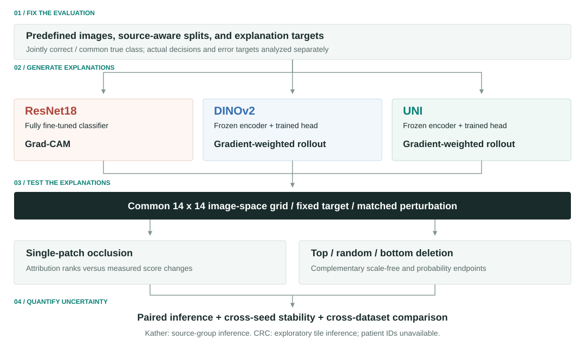
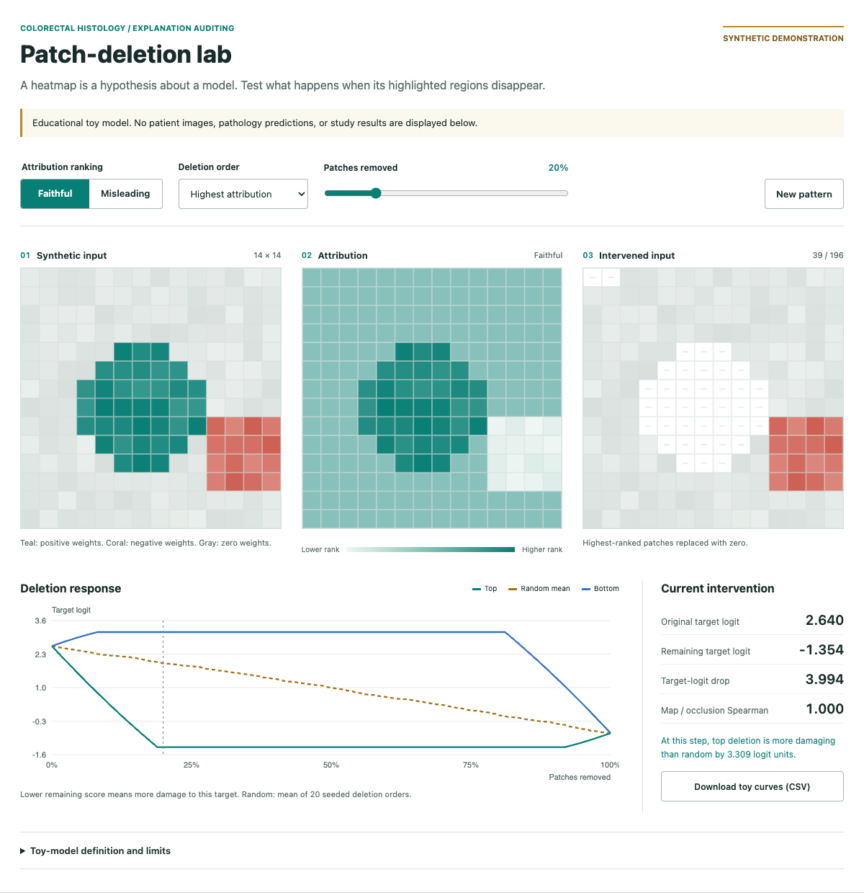

# Colorectal histology attribution audit

**A heatmap is a hypothesis about model behavior. We test it through controlled perturbations.**

This empirical study compares ResNet18 + Grad-CAM, DINOv2 + gradient-weighted
rollout, and UNI + gradient-weighted rollout on Kather-5K and a harmonized
seven-class CRC-VAL-HE-7K transfer. It evaluates image-level classification and
perturbation-based attribution faithfulness separately. Highlighted regions
contribute to model predictions; they are not biological causes of cancer.

[Explore the interactive patch-deletion lab](https://haocht10032.github.io/cancer_image_pathology/)
| [Study workflows](docs/WORKFLOWS.md)
| [Reproduce the reporting](#start-here-cpu-reporting-without-images-or-weights)
| [Citation](CITATION.cff)



## A dataset-free look at faithfulness

The interactive lab uses synthetic geometry and a transparent toy scoring function.
Switch between faithful and misleading maps, remove ranked patches, and inspect the
actual score changes. It uses no tissue images, restricted model weights, or GPU.
**This is an educational illustration, not a pathology-model result or diagnostic tool.**
See [the demo specification](docs/DEMO.md) for equations, controls, tests, and hosting.

[](https://haocht10032.github.io/cancer_image_pathology/)

## An inspectable analysis trail

| Evidence | What you can inspect |
| --- | --- |
| Predefined protocol | [Folds, cohorts, target families, and workflow sequence](docs/WORKFLOWS.md) |
| Frozen outputs | [Compact predictions and image-seed metrics](artifacts/) |
| Traceable exports | [Checksums and documented transformations](docs/PROVENANCE.md) |
| Tested reporting | [CPU reproduction checks and known limits](docs/PACKAGE_VALIDATION.md) |

The contribution is a reproducible empirical audit, not a new model architecture.
Differences concern model-training-explanation pipelines; they do not isolate a
causal effect of pathology pretraining.

**Release status:** prepared for author review, not a published/tagged release.
No license, archive DOI or full dependency lock has been approved or invented.
See `docs/RELEASE_CHECKLIST.md` before making this package public.

## Main findings

- UNI was strongest under the primary Kather evaluation, with modest absolute
  attribution-occlusion agreement and sensitivity to tissue and evaluation protocol.
- DINOv2 had the strongest external classification and patchwise agreement.
- Probability deletion favored both Transformer pipelines over ResNet18, but
  did not establish a UNI-over-DINOv2 AUC difference in any of four analyses.
- UNI more consistently beat random deletion on Kather; the corresponding external
  comparison was not supported after Holm correction.
- Penultimate-layer within-image-mean activation patching was a negative ablation.
  No causal-ranking loss was implemented.

## Start here: CPU reporting without images or weights

From this repository root, with Python and R available:

```bash
python scripts/verify_publication.py
python scripts/prepare_local_artifacts.py
Rscript environment/install_reporting_packages.R
Rscript analysis/feedback2_analysis.R
Rscript Methods/Feedback2/build_probability_tables.R
Rscript Methods/Feedback2/plot_probability_results.R
```

The final reporting entry point is `analysis/feedback2_analysis.R`. It recomputes
image-level aggregation, source-aware inference, external mapping audits, and
probability comparisons from included metrics. It writes tables to
`artifacts/feedback2_revision/reporting/` and plots to `analysis/manuscript_figures/`.
The original-tile gallery is skipped when CRC images are absent. R's `magick`
package is needed only for that optional gallery. Earlier Rmd analyses preserve
historical results and may require the separate large-output archive; they are
not substitutes for the corrected headline reporting.

`*.csv.gz` files are losslessly compressed sanitized exports. The preparation
script verifies and expands them to the paths expected by the original workflow.
Retain the compressed copies as immutable reference inputs. Reporting can regenerate
tracked tables; review changes before committing anything.

## Rerun model experiments

1. Obtain the datasets and required pretrained weights separately; see
   `docs/DATA_AND_MODELS.md`. No images or weights are redistributed here.
2. Install a compatible GPU environment using `environment/requirements-models.txt`.
   The recorded runtime is in `environment/observed_gpu_runtime.json`; this is not
   a complete tested lockfile. Obtain `pip freeze` from the original runtime before
   final release.
3. Expand the compact artifacts. Restore required large outputs/checkpoints from
   the future archive or regenerate them using the earlier notebooks.
4. Launch Jupyter from the repository root. Each notebook searches upward for this
   folder or uses `PROJECT_ROOT`. Only specify `UNI_ASSETS_DIR` for authorized local
   UNI assets; access is not bypassed.
5. Follow `docs/WORKFLOWS.md`. Do not run every notebook indiscriminately or overwrite
   the frozen outputs while trying new configurations.

The published notebooks contain no outputs or execution counts. The GPU training
workflows were not rerun during packaging. Notebook 09's superseded broad robustness
matrix is deliberately excluded; notebook 10 is the finalized bounded revision.

## Layout

- `Methods/`: project implementations and tests, with cross-module dependencies retained.
- `Notebooks/`: clean experiment entry points, including historical context clearly indexed.
- `analysis/`: reporting scripts, not private manuscript drafts or feedback.
- `artifacts/`: compact predictions, metrics, folds, cohorts and statistical outputs.
- `environment/`: dependency specifications and observed runtime information.
- `provenance/`: source/export checksum mapping and large-artifact inventory.
- `scripts/`: safe expansion and package verification.
- `docs/`: protocol, data, provenance, rights and release notes.

## Statistical interpretation

Training seeds are not independent biological samples. Kather principal inference
uses ten source groups, exact source sign flips and source-then-image bootstrap CIs.
External patient identifiers are unavailable; external paired tile inference is
exploratory. Headline means average eligible seeds within image first. Source-weighted
effects need not equal differences of image-weighted means. Probability tests use
six-test Holm families per cohort (three model pairs times two endpoints).

The final probability experiment is **deterministic_ties_v5**. Exact float32 score
ties are resolved by ascending patch index for every model. It is a documented
protocol refinement, not exact reconstruction of historical unrecorded permutations.
Versions 1-4 are excluded. See `docs/PROVENANCE.md` for the public-export hash caveat.

## Citation and rights

Authors: Haochen Tan, Hanwen Henry Ye, Annie Qu. `CITATION.cff` identifies the code
package; a manuscript DOI and release identifiers will be added when available.
The repository URL is https://github.com/haocht10032/cancer_image_pathology.

Third-party repositories and restricted weights are not bundled. No open-source
license is granted by this draft; confirm ownership, author approval and third-party
requirements before adding a license or publishing. See `docs/RIGHTS.md`.
